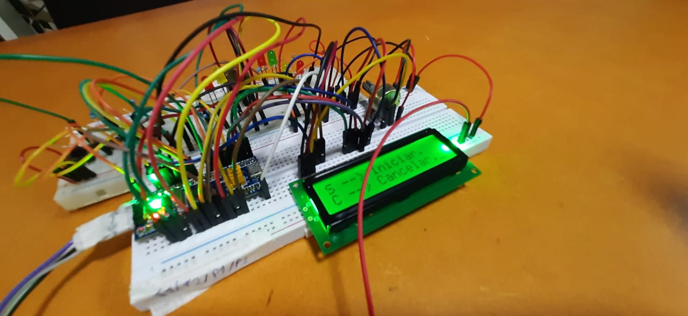
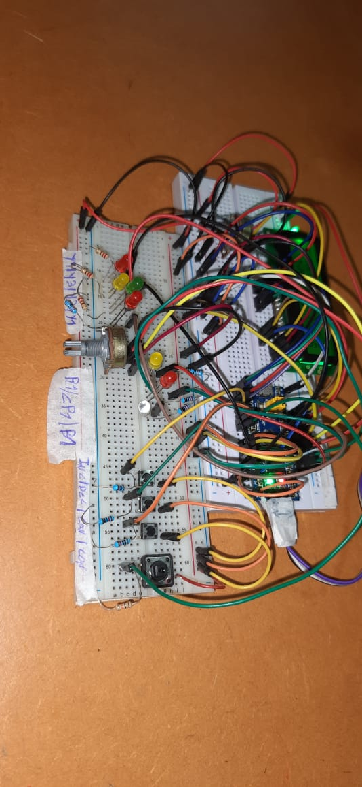
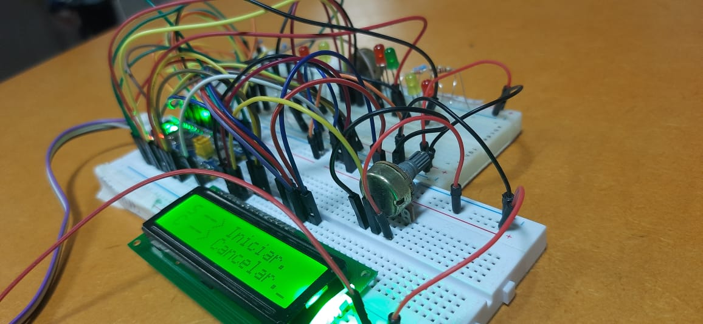

# Descrição

As cápsula são inseridas na máquina, sendo que cada cápsula tem uma receita diferente. As receitas podem ter água gelada, natural, quente e com gás. Após o usuário inserir a cápsula, a máquina detecta a receita automaticamente e inicia o processo de aquecimento ou refrigeração da água, caso necessário, e logo após inicia o despejo da água na cápsula. Vale ressaltar que caso algum pressostado indicar que algum filtro está obstruído, um aviso será indicado no display.

## Receitas

000 - Nenhuma
001 - Tipo 1 - Água (Selecionar quente, gelada ou natural)
001 - Tipo 2 - Água com gás
001 - Tipo 3 - Chá Gelado
001 - Tipo 4 - Chá Quente
001 - Tipo 5 - Refrigerante

# Menu navegação

### As entradas do usuário são os botões:
- S --> Confirmar 
- C --> Cancelar 
- I --> Incrementar 
- D --> Decrementar

A usabilidade é simples, o usuário apenas escolhe se avança ou cancela determinada ação mostrada pelo display.

Caso a capsula detectada for "Tipo 1 - água" o usuário pode escolher a água que ele desejar (quente, gelada ou natural) através dos botões "I" e "D" citados acima.

# Imagens da montagem

